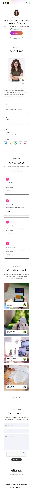
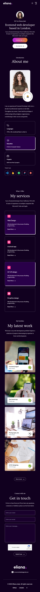
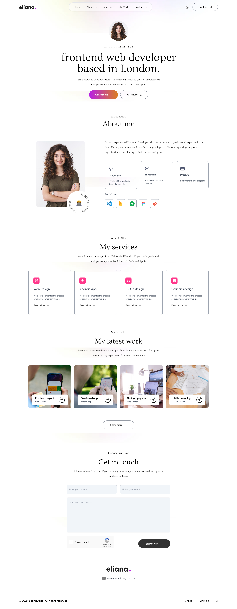
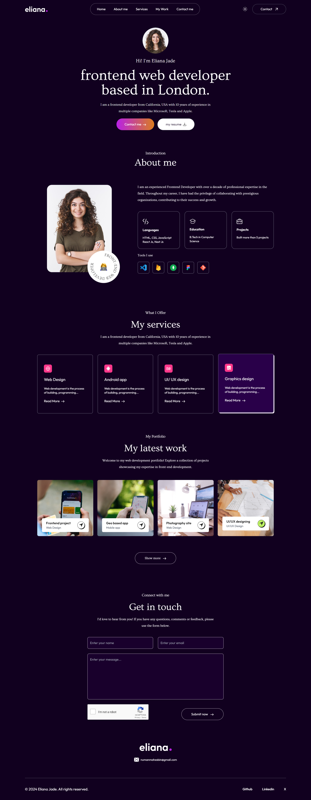

# Portfolio - Manage landing page solution

## This is template design of the [Portfolio - GreatStack](https://www.elianajade.com/).

## Table of contents

  - [Demo](#Demo)
  - [Screenshot](#screenshot)
  - [Built with](#built-with)
  - [What I learned](#what-i-learned)
  - [Continued development](#continued-development)
  - [Useful resources](#useful-resources)
- [Author](#author)

### Demo
- Solution URL: https://github.com/numanmahzabin/portfolio-tailwind
- Live Site URL: https://numanmahzabin.github.io/portfolio-tailwind

### Screenshot

### Built with

- HTML5
- Tailwind CSS [CSS Framework]
- Google Fonts
- Usebasin [for handling forms]
- reCAPTCHA v2
- Dark Theme included

### What I learned

This is my second project in Tailwind CSS. In this project I learnt to create dark theme feature for my site. Also I learnt form submission feature, including reCAPTCHA v2 and doing basic JS

I learnt to use some basic animation features

### Continued development

Now I want to focus on optimizing my sites and creating a loading page. I noticed that this site takes some time to load all the images. 

I'll try to update it with time as per I learn new things. 

### Useful resources

- https://tailwindcss.com/ - I was learning Tailwind CSS and the entire design was made with Tailwind.
- https://fonts.google.com/ - I used 'Ovo' and 'Outfit' font from this site.
- https://github.com/ - I deployed my site here.
- https://usebasin.com/app/forms - for Forms Handling.
-https://developers.google.com/recaptcha - reCAPTCHA v2

## Author

- Website - [Numan Mahzabin](https://github.com/numanmahzabin)
- Twitter - [Numan Mahzabin](https://www.twitter.com/numanmahzabin)
- Linkedin - [Numan Mahzabin](https://www.linkedin.com/in/numanmahzabin/)

## Acknowledgments

I'd like to give some credits to [Great Stack]('https://greatstack.dev/'). I got the project idea from his [Youtube channel]('https://www.youtube.com/@GreatStackDev'). I just tried to built the site on my own. here's his design's [live demo]('https://www.elianajade.com/')

Also [Basin]('https://usebasin.com/app/forms') helped to build to form sumbission system without focusing on backend. I got to include recaptcha v2 in my website as for their free service.